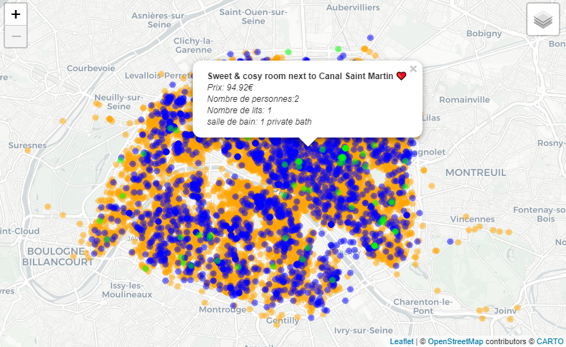

# projet-airbnb

Ce projet présente quelques analyses sur les locations airbnb dans Paris en 2021. Le dataset est récupéré sur le site [insideairbnb.com](http://insideairbnb.com/get-the-data.html).  

## Résumé 

Le fichier projetAirbnb.Rmd nettoie le dataset et présente quelques analyses sur les locations, notamment par arrondissement.

 
   
   

Le fichier analyses_par_quartier.R permet de créer des cartes affinant les analyses par quartier. Ces cartes sont exportées dans les fichiers map1_prix_moyen_quartier.html, 
map2_nb_listings_quartier.html et map3_taux_non_dispo_quartier.html.   
La carte map2_nb_listings_quartier.html est agrémentée des potentiels points d'attraction comme les salles de spectacle, grands stades et établissements du supérieur.  

  
   

Les dossiers arrondissements, quartier, fr-esr-parcoursup et le fichier lieux_spectacles.csv contiennent les données géographiques respectives des arrondissements et quartiers parisiens, des établissements du supérieur et des lieux de spectacles. 

## Packages 
data.table, dplyr, R.utils, tidyverse, htmlwidgets, rgdal, geojson, leaflet, sp, sf, RColorBrewer. 

